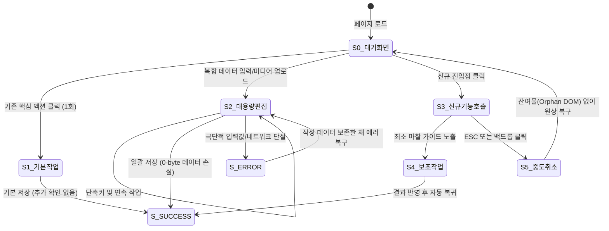

# 상태-행동 그래프 엔지니어링 (State-Action Graph Engineering)

## 1. 개요
페르소나 테스트는 단순한 '프롬프트 입력'이나 '임의의 클릭'이 아닙니다.  
사용자의 인지 흐름과 시스템의 상태 전이를 **유향 그래프(Directed Graph, $G = (V, E, I)$)**로 수학적·구조적으로 모델링하여, 변칙성을 통제하고 빈틈없는 커버리지를 보장하는 엔지니어링 기법입니다.

---

## 2. 그래프 기본 구성 요소

### (1) 상태 노드 (State Node: $V$)
유저가 마주하는 화면 및 시스템의 물리적 상태.
- $S_0$ (초기 상태): 페이지 진입 직후의 기본 상태
- $S_1, S_2, \dots$ (중간 상태): 모달 오픈, 폼 입력 중, 드롭다운 확장 등
- $S_{success}$ (목표 달성 상태): 저장이 완료되고 결과가 영속화된 상태
- $S_{error}$ (예외 상태): 네트워크 에러, 유효성 검증 실패, 권한 부족 등

### (2) 전이 엣지 (Transition Edge: $E$)
사용자가 취하는 단일 물리적 행동(Action) 또는 의사결정(Decision).
- `Click(selector)`: 특정 엘리먼트 클릭
- `Input(selector, text)`: 텍스트 입력
- `Scroll(direction, px)`: 시각적 탐색을 위한 스크롤
- `Cancel / Escape`: 진행 중인 플로우의 중단/이탈
- `Wait(condition)`: 비동기 데이터 수신 대기

### (3) 물리적 불변식 (Physical Invariant: $I$)
각 상태 노드에 도달했을 때 **반드시 성립해야 하는 물리적 단언문(Assertion)**.
- $I(S_{modal})$: `computedStyle.pointerEvents !== 'none'` AND `z-index >= 50` AND `modalRect.top >= 0`
- $I(S_{input})$: `document.activeElement === targetInput` AND `aria-hidden === null`
- $I(S_{save})$: `unchangedFields.checksum === previousChecksum` (비수정 필드 무변조)

---

## 3. 유저 여정 그래프에서 탐지해야 하는 4대 병리 현상 (Graph Pathologies)

에이전트는 그래프를 탐색하는 과정에서 다음 4가지 병리적 구조를 기계적으로 감지하여 보고해야 합니다:

```
[병리 1: 교착/함정 노드 (Deadlock / Trap State)]
  S1 ─── Action ───▶ S2 (함정 노드: 닫기 버튼 무반응, ESC 차단, 뒤로가기 시 흰 화면)

[병리 2: 유령 전이 (Phantom Action)]
  S1 ─── Click ────▶ S1 (클릭은 되었으나 로딩, 피드백, 상태 변화가 전혀 없는 무반응 상태)

[병리 3: 인지적 우회로 (Cognitive Detour)]
  과거 동선: S0 ─────────── 1-Click ───────────▶ S_success (비용: 1)
  현재 동선: S0 ── Action1 ──▶ S1 ── Action2 ──▶ S2 ── Action3 ──▶ S_success (비용: 3) -> 300% 마찰 증가!

[병리 4: 고아 잔여물 (Orphan DOM Artifact)]
  S1 ── Cancel ────▶ S0 (초기 상태로 복귀했으나 툴팁, 백드롭, 팝오버가 화면에 남아 포커스를 차단함)
```

---

## 4. Mermaid 상태 전이 그래프 모델링 템플릿

Phase 1(체크포인트)에서 사장님께 제출하는 그래프는 반드시 아래 형식의 Mermaid 다이어그램을 포함해야 합니다:



---

## 5. 그래프 검증 메트릭 (Quantitative Graph Metrics)

1. **최단 경로 길이 ($L_{min}$)**: 목표 달성까지 필요한 최소 상호작용 수
2. **분기 복잡도 ($Cyclomatic\ Complexity$)**: 사용자가 마주하는 결정 분기점(분기 선택지)의 수
3. **이탈 회복 비용 ($Recovery\ Cost$)**: 잘못 누르거나 취소했을 때 원상태로 돌아오기 위한 클릭/키스트로크 수
